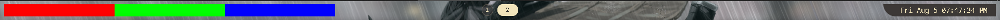

# hitokage 日と影

> [!CAUTION]
> This is a work-in-progress, mostly built for personal use until I can dedicate more time to it.
> As a consequence support and documentation is sparse, good luck.

*__hitokage__ is a configurable status bar for Windows implemented in Rust using the relm4/gtk4 framework.*

It is primarily built for usage with [ `komorebi` ](https://github.com/LGUG2Z/komorebi), but is also usable as a 
standalone drop-in replacement for the default Windows Taskbar.

Documentation and guides at: ~~https://codyduong.dev/hitokage/~~ (🚧 TODO USER FACING DOCS 🚧)

## Demo

## Installation

<!--
* Install from nightly or stable from [releases]()
* Winget `winget install hitokage`
* Powershell Gallery `Install-Module hitokage`
-->

### Developing/Building From Source

Requires
* https://github.com/Relm4/Relm4/tree/main
  + https://gtk-rs.org/gtk4-rs/git/book/installation_windows.html
  + https://github.com/wingtk/gvsbuild#development-environment

<!--
Build notes:
* msys2 pkg-config sucks -> https://github.com/rust-lang/pkg-config-rs/issues/51#issuecomment-346300858
-->

## Acknowledgements
- [`yasb`](https://github.com/da-rth/yasb) - The original inspiration for this status bar
- [`komorebi`](https://github.com/LGUG2Z/komorebi) - The tiling manager used in conjunction with this status bar
- [`ButteryTaskbar2`](https://github.com/LuisThiamNye/ButteryTaskbar2) - Hiding the default windows taskbar
- [`wezterm`](https://github.com/wez/wezterm) - Code for various WinAPI and mlua utilities

## License

MIT
