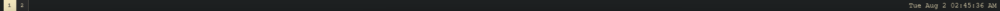
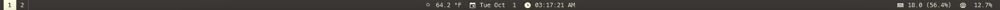

# hitokage 日と影

*hitokage is a configurable status bar for Windows implemented in Rust using the [relm4](https://github.com/Relm4/Relm4) GUI library.*

It is primarily built for usage with [ `komorebi` ](https://github.com/LGUG2Z/komorebi), but is also usable as a 
standalone drop-in replacement for the default Windows Taskbar.

[`examples/minimal`](https://github.com/codyduong/hitokage/tree/master/examples/minimal/):

 

[`examples/testbench`](https://github.com/codyduong/hitokage/tree/master/examples/testbench/):

[`codyduong`](https://github.com/codyduong/dotfiles/tree/ba4eb2b9044646ab1b33797dd9b11f2bc1a6ea4d/windows/.files/%25USERPROFILE%25/.config/hitokage):

